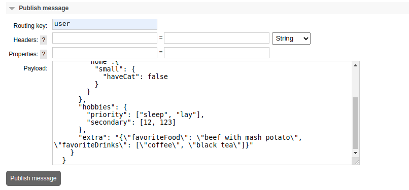

# RabbitMQ to PostgresSQL
A simple application for migrating messages from rabbitMQ to Postgres. It is configured by yaml config.  
The app collects messages in a buffer(in the example it is redis) until a batch is full. When batch is full,
the app moves messages to the DB  
Never used in production!

## What used in example
GO, RabbitMQ, Postgres, Redis

## Config
For DB set:
 - connection setting(host, port, username, password, dbname)
 - table name in which to write messages

For RabbitMQ set:
 - connection settings(dsn)
 - exchanger for subscription
 - routing key for subscription
 - prefer queue name. With what name to declare the queue. Optional. Will be created after app launch auto

For Buffer:
- connection settings(addr)
- timeout for connection
- key to save messages
- buffer size. When batch is full, the app moves messages to the DB


Settings for matching a field in a message with a field in a table. Check example below

```yaml
settings:
# Example
#  {
#    "token": "token",
#    "user": {
#      "id": 123,
#      "name": "Name",
#      "balance": 1.23,
#      "animals": {
#        "home":{
#          "small": {
#            "haveCat": false
#          }
#        }
#      },
#      "hobbies": {
#        "priority": ["sleep", "lay"],
#        "secondary": [12, 123]
#      },
#      "extra": "{\"favoriteFood\": \"beef with mash potato\", \"favoriteDrinks\": [\"coffee\", \"black tea\"]}"
#    }
#  }

  # full queue field name: table field name
  user.id: id                                             # int64
  user.name: name                                         # string
  user.balance: balance                                   # float
  user.hobbies.priority: priority_hobby                   # slice
  user.extra: extra                                       # json
  user.animals.home.small.haveCat: have_cat               # bool
```

### Create table in DB
```sql
create table raw_users
(
    id             bigint not null,
    name           text,
    balance        double precision,
    priority_hobby text,
    extra          jsonb,
    have_cat       boolean
);
```
Publish message  


## Run application
```shell
$ go run . -c config.yaml
```

Check in redis
```
localhost:6379> lrange example.key 0 -1
1) "  {\r\n    \"token\": \"token\",\r\n    \"user\": {\r\n      \"id\": 123,\r\n      \"name\": \"Name\",\r\n      \"balance\": 1.23,\r\n      \"animals\": {\r\n        \"home\":{\r\n          \"small\": {\r\n            \"haveCat\": false\r\n          }\r\n        }\r\n      },\r\n      \"hobbies\": {\r\n        \"priority\": [\"sleep\", \"lay\"],\r\n        \"secondary\": [12, 123]\r\n      },\r\n      \"extra\": \"{\\\"favoriteFood\\\": \\\"beef with mash potato\\\", \\\"favoriteDrinks\\\": [\\\"coffee\\\", \\\"black tea\\\"]}\"\r\n    }\r\n  }"

```
if set buffer.size = 1, you will immediately see the message in db
```
dbname=# select * from raw_users;
 id  | name | balance | priority_hobby  |                                        extra                                         | have_cat 
-----+------+---------+-----------------+--------------------------------------------------------------------------------------+----------
 123 | Name |    1.23 | {"sleep","lay"} | {"favoriteFood": "beef with mash potato", "favoriteDrinks": ["coffee", "black tea"]} | f
(1 row)

```
